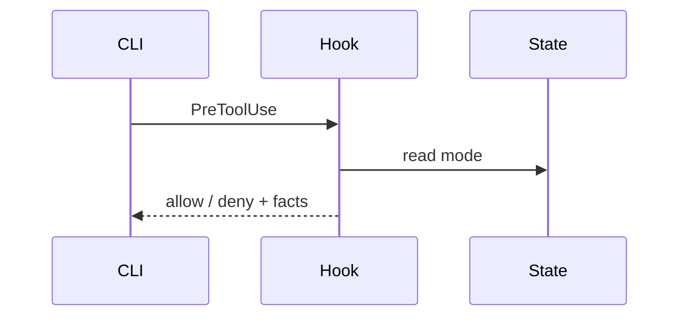

**Diagrams are load-bearing, not decoration.** Reach for one only when prose forces the reader to hold a whole shape in their head at once — then pick the smallest view that lets them see the shape instead of reconstructing it from sentences. Everything here renders in the conversation as text blocks or Mermaid; at most one artifact file is ever written.

## The vocabulary

Pick one view; two at most. More is noise.

**Pseudocode** — logic without language noise. Reduces a decision to its branching shape:

```text
on(request)
  if state file locked by another writer
    queue and return pending
  acquire lock
  write
  release
```

**Call tree** — runtime control flow. Depth shows who owns the flow; annotate where the interesting edge is:

```text
acquireStateFileLockSync()
  resolveLockPath()
  openExclusive()
  writePid()
```

**Component tree** — UI or module structure, with the boundaries that matter annotated inline:

```tsx
<SettingsPage> (src/routes/settings)
  <SessionList> (owns its fetches)
  <DangerZone>
    <ConfirmButton> (disabled until typed confirmation)
```

**File tree** — where responsibility lives; keep it shallow, one annotation per directory:

```text
src/
├── hooks/        # hook registry + types
├── tools/        # MCP tool handlers
└── workflow/     # registry + projections
```

**Mermaid** — interaction between parties, dataflow, or state transitions:



**Diff** — the shape of a change when the surrounding structure already exists. Match the diff to the topic:

a component change:

```diff
 <SettingsPage>
   <SessionList />
   <DangerZone>
+    <ConfirmButton />
   </DangerZone>
```

a file-layout change:

```diff
 src/tools/
-└── state-tools.ts
+└── state-tools/
+   ├── handlers.ts
+   └── schema.ts
```

a control-flow change:

```diff
 commit()
   stage()
     hashBlobs()
+  writeObject()
   updateRef()
+    acquireStateFileLock()
```

a state-machine change:

```diff
 on(request)
-  write immediately
+  if locked
+    queue and return pending
+  acquire lock
+  write
+  release
```

**The whole block** — when elision would hide who owns what or the order things run in, show the complete unit once, copyable:

```ts
export function isRegistryEnabled(): boolean {
  const flag = process.env.OMC_WORKFLOW_REGISTRY;
  return flag !== '0' && flag !== 'false';
}
```

## When text runs out

A UI layout, a before/after comparison, or a concept too dense for Mermaid: write one focused HTML file — a diagram, an infographic, or a few slides — styled after the product's own colors, type, and components, filled with real labels and data, working on desktop and mobile. Open it with the platform opener (`start` on Windows, `open` on macOS, `xdg-open` on Linux) and stop there: one artifact, not a gallery.

## Discipline

- Place each visual directly beside the two or three sentences it supports.
- Carry only the calls, files, props, states, and boundaries that answer the current question — every extra node is a decoding tax on the reader.
- If the honest answer fits in one sentence, write the sentence.
